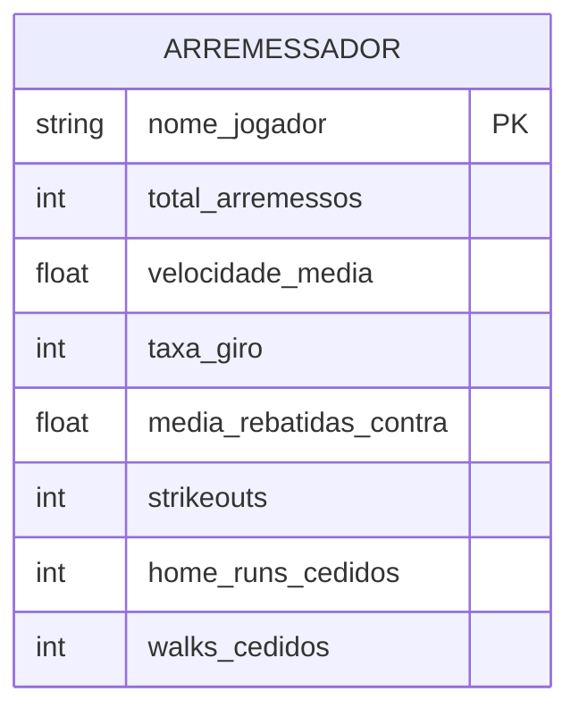

# Modelagem e Cenários de Teste (Statcast - Dados Agregados)

## 1. Modelo Entidade-Relacionamento (ER)

Como o conjunto de dados atual (`statcast_data.csv`) contém **estatísticas agregadas por arremessador na temporada**, o modelo ER precisou ser simplificado em relação à nossa ideia original.

Não temos a granularidade de **"Partidas"** ou **"Jogadas"** neste arquivo. O modelo agora gira em torno de uma entidade central de **DESEMPENHO_ARREMESSADOR** (ou apenas Arremessador).



---

## 2. Cenários de Teste ACID (Delta Lake e Apache Iceberg)

Com os dados de formato longo consolidados, você e seus colegas podem testar operações ACID (Update e Delete):

### Cenário 1: UPDATE (Correção de Estatística Oficial da Liga)
* **Contexto Real**: Após uma revisão oficial no final da temporada, a MLB determinou que um dos Strikeouts creditados ao arremessador "Webb, Logan" foi na verdade uma bola foul. A liga manda remover 1 strikeout do total dele.
* **Objetivo do Teste**: Modificar as estatísticas de um jogador sem reprocessar a tabela inteira.

**Exemplo Prático (Delta Lake via PySpark):**
```python
from delta.tables import DeltaTable

tabela_delta = DeltaTable.forPath(spark, "caminho/para/tabela_delta_arremessadores")

tabela_delta.update(
    condition = "nome_jogador = 'Webb, Logan'",
    set = { "strikeouts": "strikeouts - 1" }
)
```

### Cenário 2: DELETE (Remoção de Jogador por Sanção)
* **Contexto Real**: Um arremessador violou diretrizes de integridade da liga e seus dados da temporada precisam ser expurgados da plataforma analítica.
* **Objetivo do Teste**: Remover fisicamente a linha de estatísticas do jogador.

**Exemplo Prático (Apache Iceberg via Spark SQL):**
```sql
DELETE FROM meu_catalogo.banco_iceberg.estatisticas_arremessadores
WHERE nome_jogador = 'Jogador, Banido';
```
