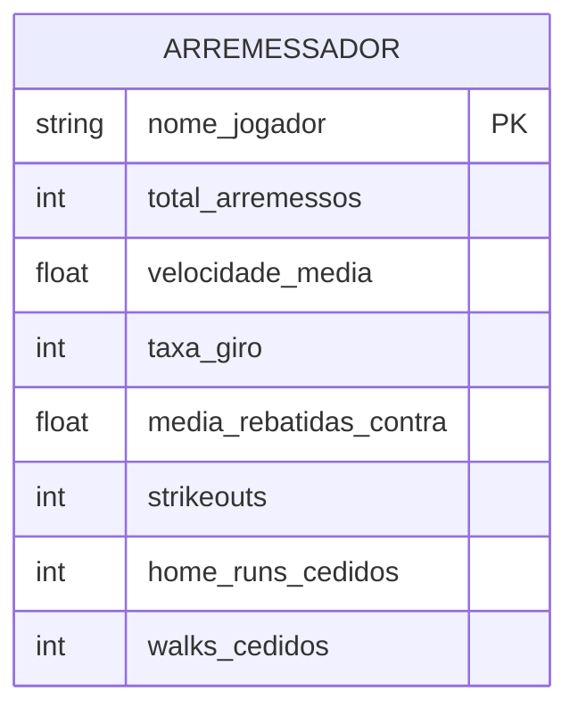

# Modelagem e Cenários de Teste (Statcast - Dados Agregados)

## 1. Modelo Entidade-Relacionamento (ER)

Como o conjunto de dados atual (`statcast_data.csv`) contém **estatísticas agregadas por arremessador na temporada**, o modelo ER precisou ser simplificado em relação à nossa ideia original.

Não temos a granularidade de **"Partidas"** ou **"Jogadas"** neste arquivo. O modelo agora gira em torno de uma entidade central de **DESEMPENHO_ARREMESSADOR** (ou apenas Arremessador).



---

## 2. Cenários de Teste ACID (Delta Lake e Apache Iceberg)

Com a base de arremessadores carregada, os cenários de mutação foram padronizados para os dois formatos de tabela, garantindo comparação direta entre Delta e Iceberg.

### Cenário 1: UPDATE (Correção de `velocidade_media`)

- **Contexto real**: após revisão de telemetria, o valor de velocidade média de **Webb, Logan** precisa ser corrigido para **89.2**.
- **Objetivo do teste**: alterar apenas uma coluna de um jogador específico sem reprocessar o CSV inteiro.

**Exemplo prático (Delta Lake via PySpark):**

```python
from delta.tables import DeltaTable
import pyspark.sql.functions as F

tabela_delta = DeltaTable.forPath(spark, "data/delta_statcast")

tabela_delta.update(
    condition="nome_jogador = 'Webb, Logan'",
    set={"velocidade_media": F.lit(89.2)},
)
```

**Exemplo prático (Iceberg via Spark SQL):**

```sql
UPDATE ice.baseball.statcast_arremessadores
SET velocidade_media = 89.2
WHERE nome_jogador = 'Webb, Logan';
```

### Cenário 2: DELETE (Remoção de jogador por sanção/saneamento)

- **Contexto real**: o registro de **Rodón, Carlos** precisa ser expurgado da camada analítica (sanção ou invalidação do dado).
- **Objetivo do teste**: remover a linha do jogador e confirmar que ela não aparece mais no conjunto atual.

**Exemplo prático (Delta Lake):**

```python
tabela_delta.delete(condition="nome_jogador = 'Rodón, Carlos'")
```

**Exemplo prático (Iceberg via Spark SQL):**

```sql
DELETE FROM ice.baseball.statcast_arremessadores
WHERE nome_jogador = 'Rodón, Carlos';
```

### Cenário 3: Auditoria e histórico

Depois das mutações, a equipe consulta histórico para comprovar rastreabilidade:

- **Delta Lake**: `history()` e leitura por `versionAsOf`;
- **Iceberg**: tabelas de metadados `snapshots` e `history`.
